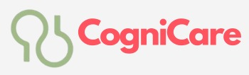

PS-3 Syrus Hackathon - Empowering Alzheimer's Support through Innovation

<h1 align="center" id="title"> </h1>

<h3 align="center">🧑‍🤝‍🧑Empowering Minds, Restoring Memories🧑‍🤝‍🧑</h3>

CogniCare helps explore many ways to fight against Alzheimer's disease and all other dementia. Together, we stand strong. Get involved with CogniCare Now!

<h2>🧐 Features</h2>

Here are some of the project's best features:

*   User Friendly Interface
*   Memory-enhancing games to enhance cognitive ability.
*   Google Calendars List for Reminders and Medication Management
*   Calling services and video chat functionality for one-to-one sessions with 	healthcare professionals.
*   Chat application for users to connect with peers facing similar challenges.
*   Emergency assistance feature for swift help in crises

<h2> 💻 Built with</h2>

<h3>⚙️Technologies used in the project:</h3>

 
<h4> FrontEnd: </h4>

<h4> BackEnd: </h4>
    

<h4> Additional Tools and Libraries: </h4>

  
